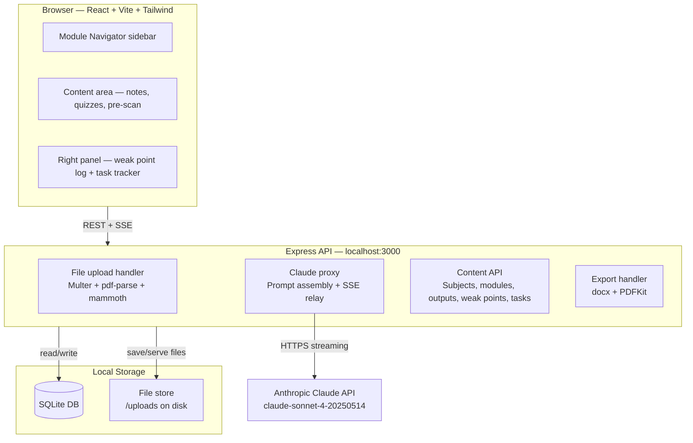
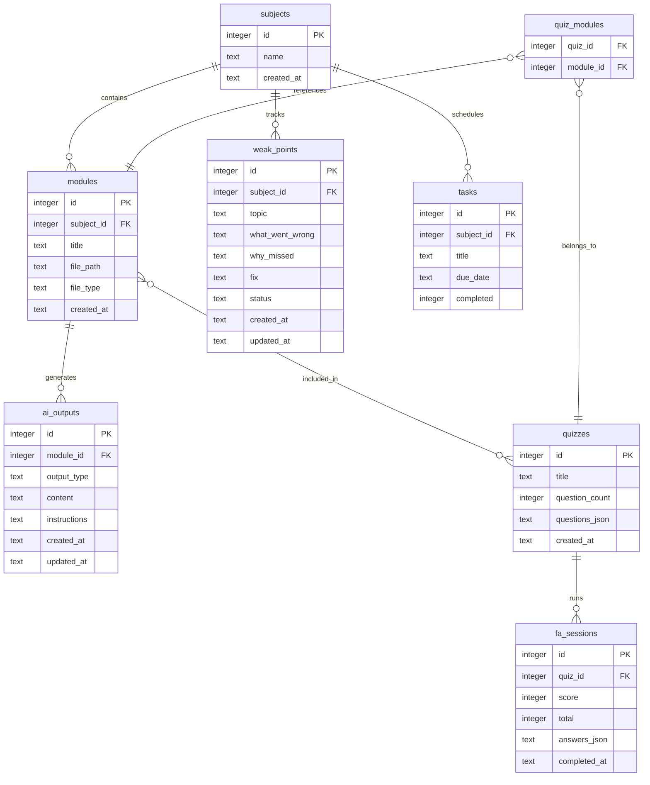
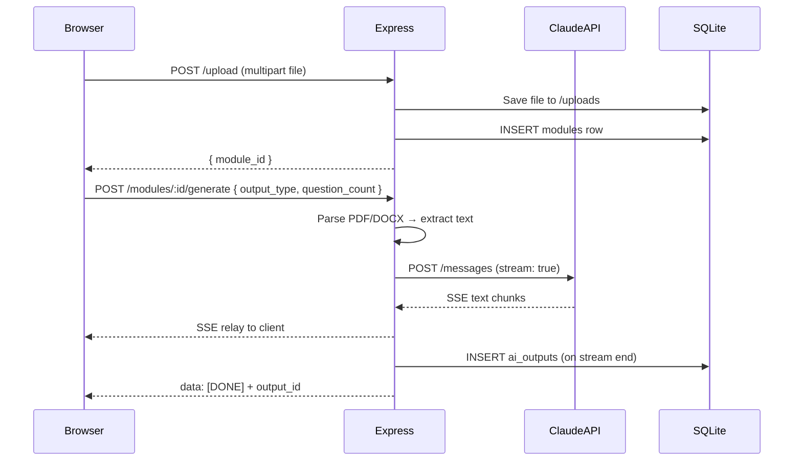
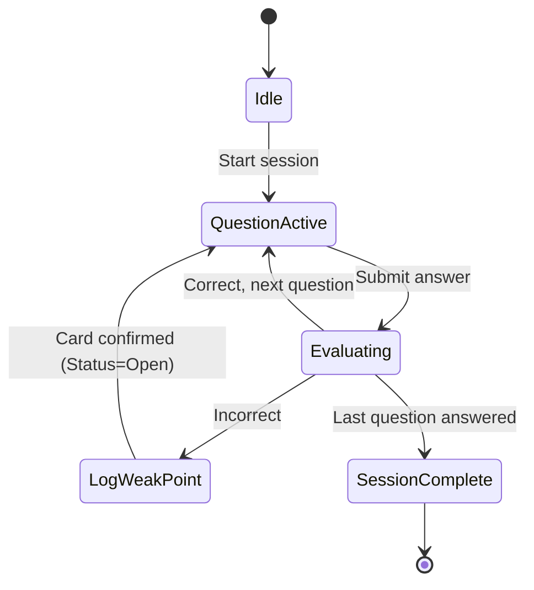
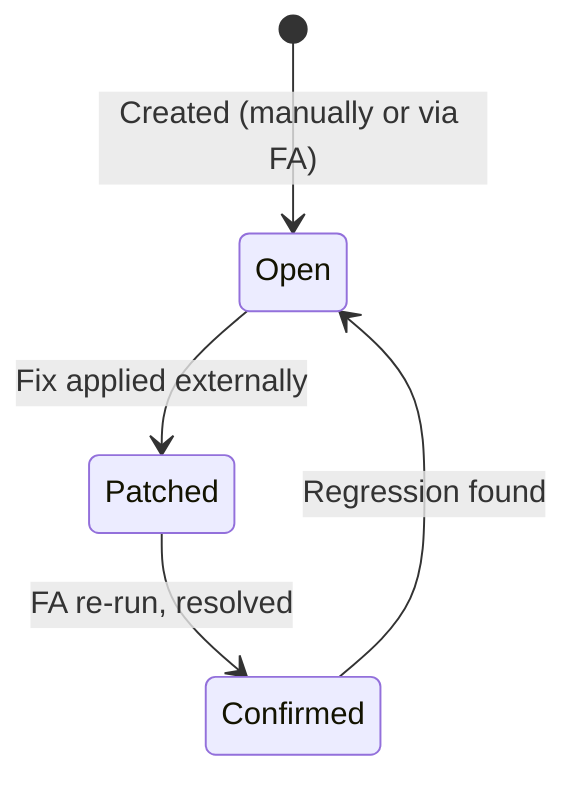

# Ianne's Study Hub — Architecture Specification

**Version:** 1.0  
**Date:** April 16, 2026  
**Based on PRD:** v1.2, April 16, 2026  
**Status:** Draft

---

## 1. System Overview

Ianne's Study Hub is a local-only, single-user academic productivity tool built as a monorepo with a React frontend and an Express backend running on localhost. The user interacts with a browser-based UI; the backend handles file uploads, content extraction, Claude API calls, and all data persistence. No cloud infrastructure is involved — the database, uploaded files, and all AI outputs live entirely on the user's machine.

The system has three primary service boundaries: the **React client** (UI rendering, streaming display, local state), the **Express API server** (file handling, Claude proxy, REST CRUD), and **local storage** (SQLite for relational data, filesystem for uploaded files). The Claude API is the only external dependency — module content is sent to Anthropic for processing and responses are streamed back to the client via Server-Sent Events.

The architecture is intentionally minimal: no auth, no cloud sync, no real-time between sessions, no background jobs. Every design choice optimizes for fast local development and zero infrastructure overhead during a thesis-heavy term.

### System Architecture Diagram



---

## 2. Tech Stack

| Layer | Technology | Version | Justification |
|---|---|---|---|
| Frontend | React + Vite | React 18, Vite 5 | User's primary stack; fast HMR for development |
| Styling | Tailwind CSS | v3 | User's primary stack; utility-first, no CSS files to maintain |
| Backend | Node.js + Express | Node 20 LTS, Express 4 | Familiar ecosystem; Multer file upload handling is mature |
| Database | SQLite via better-sqlite3 | latest | Single-user local-first; synchronous API simplifies backend code significantly |
| Auth | None | — | v1 is single-user, localhost only |
| File Storage | Local filesystem | — | Files saved to `/server/uploads/`; served by Express static middleware |
| PDF parsing | pdf-parse | latest | Extracts text content from PDF buffers server-side |
| DOCX parsing | mammoth | latest | Converts DOCX to plain text or simplified HTML server-side |
| AI | Anthropic SDK (`@anthropic-ai/sdk`) | latest | Official SDK; handles streaming, retries, type safety |
| Export — DOCX | docx | latest | Programmatic DOCX generation for Reviewer export |
| Export — PDF | PDFKit | latest | Programmatic PDF generation for Reviewer export |
| Markdown rendering | react-markdown + rehype-sanitize + remark-gfm | latest | React-native rendering of AI outputs; sanitized pipeline; GFM for tables + strikethrough |
| Hosting | localhost only | — | v1 personal use; no deployment |
| API Style | REST (JSON) | — | Simple, no coupling; SSE for streaming AI outputs |

---

## 3. Data Model

### ERD



### Entity Descriptions

#### `subjects`
| Field | Type | Constraints | Description |
|---|---|---|---|
| id | INTEGER | PK, autoincrement | Primary key |
| name | TEXT | NOT NULL, UNIQUE | Subject name (e.g., "Operating Systems") |
| created_at | TEXT | NOT NULL, DEFAULT now | ISO 8601 timestamp |

#### `modules`
| Field | Type | Constraints | Description |
|---|---|---|---|
| id | INTEGER | PK, autoincrement | Primary key |
| subject_id | INTEGER | FK → subjects.id, NOT NULL | Parent subject |
| title | TEXT | NOT NULL | Display name for the module |
| file_path | TEXT | NOT NULL | Relative path to uploaded file under /uploads |
| file_type | TEXT | NOT NULL | `pdf` or `docx` |
| created_at | TEXT | NOT NULL | ISO 8601 timestamp |

#### `ai_outputs`
| Field | Type | Constraints | Description |
|---|---|---|---|
| id | INTEGER | PK, autoincrement | Primary key |
| module_id | INTEGER | FK → modules.id, NOT NULL | Source module |
| output_type | TEXT | NOT NULL | One of: `prescan`, `notes`, `quiz` |
| content | TEXT | NOT NULL | Full AI-generated content (markdown or JSON for quizzes) |
| instructions | TEXT | NULLABLE | User's last regeneration instruction, if any |
| created_at | TEXT | NOT NULL | ISO 8601 timestamp |
| updated_at | TEXT | NOT NULL | Updated on every edit or regeneration |

> **Note:** Quizzes generated from multiple modules are stored in the `quizzes` table, not here. `ai_outputs` stores per-module outputs (pre-scan, notes, single-module quiz output).

#### `quizzes`
| Field | Type | Constraints | Description |
|---|---|---|---|
| id | INTEGER | PK, autoincrement | Primary key |
| title | TEXT | NOT NULL | User-assigned or auto-generated title |
| question_count | INTEGER | NOT NULL | Requested question count |
| questions_json | TEXT | NOT NULL | Serialized array of question objects (see schema below) |
| created_at | TEXT | NOT NULL | ISO 8601 timestamp |

**Question object schema (inside `questions_json`):**
```json
{
  "id": "string",
  "type": "mcq" | "short_answer",
  "question": "string",
  "choices": ["A", "B", "C", "D"],   // MCQ only
  "answer": "string",
  "topic": "string",                  // Used to pre-fill Error Card topic
  "module_id": number                 // Source module reference
}
```

#### `quiz_modules` (junction table)
| Field | Type | Constraints | Description |
|---|---|---|---|
| quiz_id | INTEGER | FK → quizzes.id, NOT NULL | Quiz reference |
| module_id | INTEGER | FK → modules.id, NOT NULL | Module reference |

> Composite PK: `(quiz_id, module_id)`. Supports both single-module and multi-module quiz construction without schema changes.

#### `fa_sessions`
| Field | Type | Constraints | Description |
|---|---|---|---|
| id | INTEGER | PK, autoincrement | Primary key |
| quiz_id | INTEGER | FK → quizzes.id, NOT NULL | Source quiz |
| score | INTEGER | NOT NULL | Number of correct answers |
| total | INTEGER | NOT NULL | Total questions in session |
| answers_json | TEXT | NOT NULL | Serialized array of `{question_id, user_answer, correct}` |
| completed_at | TEXT | NULLABLE | NULL = session in progress (resumable); set on completion |

#### `weak_points`
| Field | Type | Constraints | Description |
|---|---|---|---|
| id | INTEGER | PK, autoincrement | Primary key |
| subject_id | INTEGER | FK → subjects.id, NOT NULL | Parent subject |
| topic | TEXT | NOT NULL | Specific concept (not module name) |
| what_went_wrong | TEXT | NOT NULL | One-sentence error description |
| why_missed | TEXT | NOT NULL | Root cause |
| fix | TEXT | NOT NULL | Specific remediation action |
| status | TEXT | NOT NULL, DEFAULT 'Open' | `Open`, `Patched`, or `Confirmed` |
| created_at | TEXT | NOT NULL | ISO 8601 timestamp |
| updated_at | TEXT | NOT NULL | Updated on every edit or status change |

#### `tasks`
| Field | Type | Constraints | Description |
|---|---|---|---|
| id | INTEGER | PK, autoincrement | Primary key |
| subject_id | INTEGER | FK → subjects.id, NULLABLE | Optional subject tag |
| title | TEXT | NOT NULL | Task description |
| due_date | TEXT | NOT NULL | ISO 8601 date string (YYYY-MM-DD) |
| completed | INTEGER | NOT NULL, DEFAULT 0 | Boolean as integer (0/1) |

---

## 4. API Contract

### Base URL
- Development: `http://localhost:3000/api`

### Authentication
None. All routes are unauthenticated. The server binds to localhost only.

---

### Subjects

#### `GET /subjects`
Returns all subjects.
- **Response 200:** `{ subjects: [{ id, name, created_at }] }`

#### `POST /subjects`
- **Body:** `{ name: string }`
- **Response 201:** `{ subject: { id, name, created_at } }`
- **Response 400:** `{ error: "name is required" }`

#### `DELETE /subjects/:id`
Deletes subject and cascades to modules, outputs, weak points, tasks.
- **Response 200:** `{ deleted: true }`
- **Response 404:** `{ error: "not found" }`

---

### Modules

#### `GET /subjects/:subjectId/modules`
Returns all modules for a subject, including their ai_output types.
- **Response 200:** `{ modules: [{ id, title, file_type, created_at, outputs: [{ id, output_type, updated_at }] }] }`

#### `POST /subjects/:subjectId/modules/upload`
Uploads a file and creates a module record.
- **Body:** `multipart/form-data` — field `file` (PDF or DOCX, max 20MB), field `title` (string)
- **Response 201:** `{ module: { id, subject_id, title, file_type, created_at } }`
- **Response 400:** `{ error: "unsupported file type" | "file too large" | "title is required" }`

#### `DELETE /modules/:id`
Deletes module, its file from disk, and all associated ai_outputs.
- **Response 200:** `{ deleted: true }`

---

### AI Generation

#### `POST /modules/:moduleId/generate`
Triggers AI generation for a single module. Streams response via SSE.
- **Body:** `{ output_type: "prescan" | "notes" | "quiz", question_count?: number, instructions?: string }`
- **Response:** `text/event-stream` — chunks of generated content, then `data: [DONE]`
- **After stream ends:** Output is saved as an `ai_outputs` row. Client polls `GET /outputs/:id` for the saved record.
- **Response 400:** `{ error: "invalid output_type" | "question_count required for quiz" }`

#### `POST /generate/multi-module-quiz`
Generates a quiz spanning multiple modules. Streams response.
- **Body:** `{ module_ids: number[], question_count: number, title?: string }`
- **Response:** `text/event-stream` — same SSE protocol as above
- **After stream ends:** Quiz and `quiz_modules` junction rows are saved. Returns `{ quiz_id }` in final SSE event.
- **Response 400:** `{ error: "at least 2 module_ids required" | "question_count required" }`

#### `POST /outputs/:outputId/regenerate`
Regenerates an existing output with updated instructions.
- **Body:** `{ instructions: string }`
- **Response:** `text/event-stream` — streams new content; replaces existing `content` and `instructions` on completion.

---

### AI Outputs

#### `GET /outputs/:id`
Returns a single ai_output record.
- **Response 200:** `{ output: { id, module_id, output_type, content, instructions, created_at, updated_at } }`

#### `PATCH /outputs/:id`
Saves inline edits to output content.
- **Body:** `{ content: string }`
- **Response 200:** `{ output: { id, updated_at } }`

---

### Quizzes & FA Sessions

#### `GET /subjects/:subjectId/quizzes`
Returns all quizzes for a subject (single + multi-module).
- **Response 200:** `{ quizzes: [{ id, title, question_count, created_at, modules: [{ id, title }] }] }`

#### `GET /quizzes/:id`
Returns full quiz with parsed questions.
- **Response 200:** `{ quiz: { id, title, questions: [...], modules: [...] } }`

#### `POST /quizzes/:id/sessions`
Starts or completes an FA session.
- **Body (start):** `{}`
- **Body (complete):** `{ answers: [{ question_id, user_answer, correct }] }`
- **Response 201:** `{ session: { id, quiz_id, score, total, completed_at } }`

#### `GET /quizzes/:id/sessions/:sessionId`
Returns a completed FA session with per-question results.
- **Response 200:** `{ session: { id, score, total, answers: [...] } }`

---

### Weak Points

#### `GET /subjects/:subjectId/weak-points`
Returns all weak points for a subject, optionally filtered by status.
- **Query:** `?status=Open|Patched|Confirmed` (optional)
- **Response 200:** `{ weak_points: [{ id, topic, what_went_wrong, why_missed, fix, status, created_at, updated_at }] }`

#### `POST /subjects/:subjectId/weak-points`
Creates a new Error Card.
- **Body:** `{ topic, what_went_wrong, why_missed, fix, status?: "Open" }`
- **Response 201:** `{ weak_point: { id, ...fields } }`
- **Response 400:** `{ error: "all fields required" | "invalid status" }`

#### `PATCH /weak-points/:id`
Updates any field on a weak point (used for status changes and edits).
- **Body:** Partial `{ topic?, what_went_wrong?, why_missed?, fix?, status? }`
- **Response 200:** `{ weak_point: { id, updated_at } }`

#### `DELETE /weak-points/:id`
- **Response 200:** `{ deleted: true }`

---

### Reviewer Export

#### `POST /subjects/:subjectId/reviewer/export`
Generates and returns a Reviewer document from all `Confirmed` weak points.
- **Body:** `{ format: "docx" | "pdf" }`
- **Response 200:** Binary file download (`Content-Disposition: attachment`)
- **Response 400:** `{ error: "no Confirmed weak points found" }`
- **Response 422:** `{ error: "invalid format" }`

---

### Tasks

#### `GET /subjects/:subjectId/tasks`
Returns all tasks for a subject.
- **Response 200:** `{ tasks: [{ id, title, due_date, completed }] }`

#### `GET /tasks`
Returns all tasks across all subjects (for calendar view).
- **Query:** `?from=YYYY-MM-DD&to=YYYY-MM-DD` (optional)
- **Response 200:** `{ tasks: [{ id, subject_id, subject_name, title, due_date, completed }] }`

#### `POST /subjects/:subjectId/tasks`
- **Body:** `{ title: string, due_date: string }`
- **Response 201:** `{ task: { id, title, due_date, completed: false } }`

#### `PATCH /tasks/:id`
- **Body:** `{ title?, due_date?, completed? }`
- **Response 200:** `{ task: { id } }`

#### `DELETE /tasks/:id`
- **Response 200:** `{ deleted: true }`

---

## 5. Diagrams

### Module Processing Sequence



### FA Session State Machine



### Weak Point Status Lifecycle



---

## 6. Folder Structure

```
study-hub/
├── client/                     # React + Vite frontend
│   ├── src/
│   │   ├── components/
│   │   │   ├── layout/         # AppShell, Sidebar, RightPanel
│   │   │   ├── modules/        # ModuleCard, UploadZone, OutputViewer
│   │   │   ├── quiz/           # QuizBuilder, FASessionRunner, QuestionCard
│   │   │   ├── weak-points/    # WeakPointLog, ErrorCard, StatusBadge
│   │   │   ├── tasks/          # TaskList, CalendarView, TaskForm
│   │   │   └── ui/             # Shared primitives: Button, Modal, Badge, etc.
│   │   ├── hooks/
│   │   │   ├── useStreamingOutput.ts   # SSE consumer for AI generation
│   │   │   ├── useSubjects.ts
│   │   │   ├── useModules.ts
│   │   │   └── useWeakPoints.ts
│   │   ├── pages/              # Route-level components (if using React Router)
│   │   ├── lib/
│   │   │   ├── api.ts          # Typed fetch wrappers for all API routes
│   │   │   └── utils.ts
│   │   ├── types/              # Shared TypeScript types matching DB schema
│   │   └── main.tsx
│   ├── index.html
│   ├── vite.config.ts
│   └── tailwind.config.ts
│
├── server/                     # Node.js + Express backend
│   ├── src/
│   │   ├── routes/
│   │   │   ├── subjects.ts
│   │   │   ├── modules.ts
│   │   │   ├── generate.ts     # AI generation + SSE streaming
│   │   │   ├── outputs.ts
│   │   │   ├── quizzes.ts
│   │   │   ├── weak-points.ts
│   │   │   ├── tasks.ts
│   │   │   └── reviewer.ts     # Export generation
│   │   ├── services/
│   │   │   ├── claude.ts       # Anthropic SDK wrapper + prompt builders
│   │   │   ├── parser.ts       # pdf-parse + mammoth text extraction
│   │   │   └── exporter.ts     # docx + PDFKit Reviewer generation
│   │   ├── db/
│   │   │   ├── index.ts        # better-sqlite3 connection singleton
│   │   │   ├── schema.sql      # Table definitions
│   │   │   └── migrations/     # Numbered migration files
│   │   ├── middleware/
│   │   │   ├── upload.ts       # Multer config (20MB limit, type check)
│   │   │   └── errorHandler.ts
│   │   └── index.ts            # Express app bootstrap
│   ├── uploads/                # Uploaded files (gitignored)
│   └── tsconfig.json
│
├── shared/                     # Shared TypeScript types (imported by both)
│   └── types.ts
│
├── study-hub.db                # SQLite database file (gitignored)
├── .env                        # ANTHROPIC_API_KEY (gitignored)
├── .env.example
├── package.json                # Root package with workspace scripts
└── README.md
```

---

## 7. Key Design Decisions

| Decision | Options Considered | Choice | Reason |
|---|---|---|---|
| Backend framework | Express vs Hono | Express | Multer (file uploads) and ecosystem familiarity; no meaningful perf gain from Hono at localhost scale |
| Database driver | better-sqlite3 vs sqlite3 vs Drizzle | better-sqlite3 | Synchronous API eliminates async complexity for a single-user, localhost app; no ORM overhead |
| AI streaming | Polling vs WebSocket vs SSE | SSE (Server-Sent Events) | Unidirectional server→client stream; simpler than WebSocket for this use case; native browser support |
| Quiz storage | Separate `questions` table vs JSON blob | JSON blob in `questions_json` | Questions don't need to be individually queried or joined; blob keeps the schema flat and reads/writes atomic |
| Multi-module quiz | Separate table vs reuse `ai_outputs` | Separate `quizzes` + `quiz_modules` junction | Clean many-to-many; allows single-module quizzes to also use the same table without duplication |
| File parsing | Client-side vs server-side | Server-side (pdf-parse + mammoth) | Keeps raw text off the client; API key stays server-side; handles large files without browser memory limits |
| Reviewer export | In-app render vs file export | File export only (DOCX + PDF) | Per PRD decision; avoids building a document renderer; docx/PDFKit are straightforward to implement |
| Monorepo structure | Separate repos vs monorepo | Monorepo (`client/` + `server/`) | Shared types; single `npm run dev` command; simpler for solo development |

---

## 8. Security Considerations

| Threat | Mitigation |
|---|---|
| API key exposure | `ANTHROPIC_API_KEY` stored in `.env`, never sent to client, never logged |
| Malicious file upload | Multer validates MIME type + extension; 20MB hard limit; files stored outside web root |
| Path traversal in file serving | Use `path.resolve()` + check that resolved path starts with `/uploads` before serving |
| XSS in rendered AI output | Render AI content as markdown via a sanitizing renderer (e.g., `marked` + `DOMPurify`); never `dangerouslySetInnerHTML` raw content |
| Runaway Claude API costs | Add per-request timeout (30s); no retry loop on generation routes; user-triggered only |
| SQLite injection | Use parameterized queries via better-sqlite3 prepared statements exclusively |

---

## 9. Open Questions

All questions resolved.

| # | Question | Decision | Reason |
|---|---|---|---|
| 1 | Auto-save vs explicit Save on output edits? | **Auto-save on blur** | Lower friction; no save state to manage in UI |
| 2 | FA session resume across page reload? | **Yes — resume in progress** | `fa_sessions` rows with `completed_at = NULL` are treated as resumable; client restores last answered question index from `answers_json` |
| 3 | Manual vs auto-trigger for Reviewer export? | **Manual trigger** | Avoids regenerating a potentially large document on every status change; user controls when they want the export |
| 4 | Markdown renderer? | **`react-markdown` + `rehype-sanitize` + `remark-gfm`** | Composes naturally with React JSX; `rehype-sanitize` handles XSS in the same pipeline; `remark-gfm` supports tables and strikethrough that Claude outputs naturally |

---

## Appendix

- PRD: `PRD.md` — v1.2, April 16, 2026
- Academic Workflow source: `Academic_Workflow_3Y3T.docx` — v2.0, Refined for Thesis-Heavy Terms
- Claude API docs: https://docs.anthropic.com
- Anthropic SDK: `@anthropic-ai/sdk`
- Workflow phases operationalized: Pre-Scan (I), FA Protocol (III), Weak Point Logging (IV), Iteration (V), Reviewer Maintenance (VI), Examination Protocol (VII)
